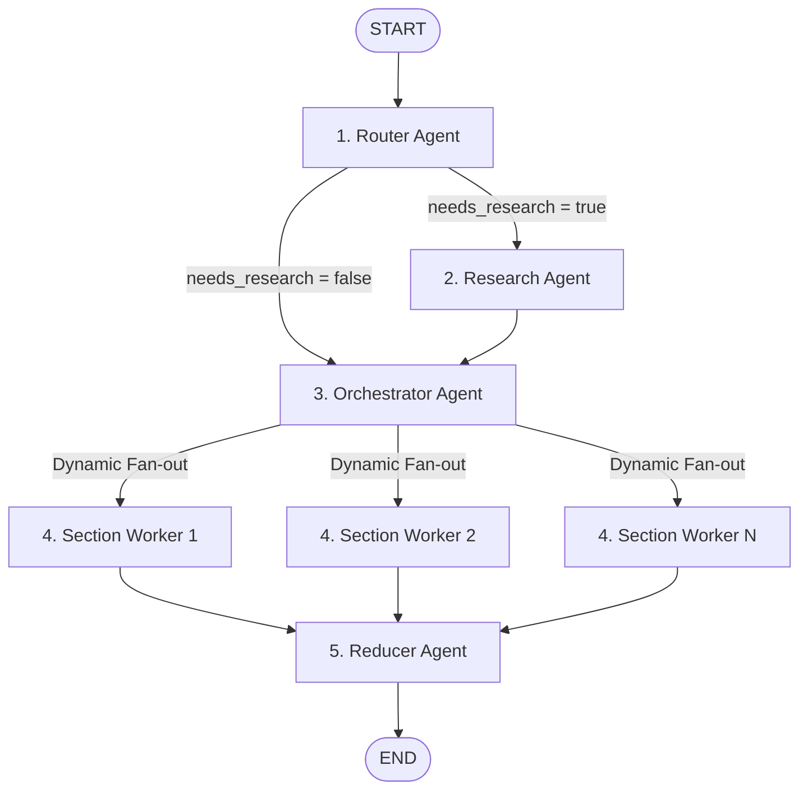

# BlogGenius 🚀
 live link:https://bloggenius-16.streamlit.app/

**BlogGenius** is a premium, multi-agent AI blog writing workstation built on top of [LangGraph](https://github.com/langchain-ai/langgraph) and [Streamlit](https://streamlit.io). It automates high-quality technical article drafting by routing, researching, outlines structuring, parallel section-writing, and final article assembly.

The application features a modern, premium **Cinematic Dark Theme** workspace designed with glassmorphic cards, layout structures, and real-time developer terminal logs.

---

## 🏗️ Architecture & Workflow

BlogGenius uses a multi-agent state graph pipeline optimized for high-quality technical prose:



### Agents Pipeline Roles
1. **Router Agent (`router`)**: Analyzes the topic, determines the writing mode (`closed_book` for evergreen ideas, `hybrid` for up-to-date additions, or `open_book` for news/volatile topics), and suggests Tavily research queries.
2. **Research Agent (`research`)**: Executes searches in parallel, synthesizes raw results, parses metadata, and outputs structured, deduplicated `EvidenceItem` resources.
3. **Orchestrator Agent (`orchestrator`)**: Drafts an execution plan outlining the article's structure, tone, constraints, and distinct section tasks (goals, target word counts, and criteria like code examples or citation requirements).
4. **Section Workers (`worker`)**: Map-reduces individual sections in parallel. Each worker writes a separate markdown section based on constraints, code snippets, and evidence URLs.
5. **Reducer Agent (`reducer`)**: Sorts and concatenates written sections chronologically into a single, cohesive markdown document, and exports the final file straight to the environment root.

---

## 🎨 UI/UX Features

- **Obsidian Dark Aesthetic**: Sleek slate background with subtle neon-violet glowing backdrops.
- **Dual-Column Grid Layout**:
  - **Left Sidebar Drawer**: Create Blog form (Topic area, date setting, Generate CTA) and local blog library (browse and reload past articles).
  - **Right Main Screen**: Pipeline execution progress visualizer, compiled result tabs (Outline Plan, Gathered Evidence, Markdown Preview, and System Event Log).
- **Glassmorphism Design**: Layout panels and containers feature translucent glass blur backdrops and soft glow hover transitions.
- **Developer Console Logger**: System event logs are styled like an interactive dev terminal with customized monospaced styling.

---

## ⚙️ Getting Started

### Prerequisites
- Python 3.9 or higher
- Groq API Key (for ChatGroq/Llama-3.3 model execution)
- Tavily API Key (for web research operations)

### Installation

1. Clone or copy this repository to your local machine:
   ```bash
   cd blog_writing_agent
   ```

2. Create and activate a virtual environment:
   ```bash
   # Windows (PowerShell)
   python -m venv venv
   .\venv\Scripts\Activate.ps1
   
   # Linux / macOS
   python3 -m venv venv
   source venv/bin/activate
   ```

3. Install requirements:
   ```bash
   pip install -r requirements.txt
   ```

### Configuration

Create a `.env` file in the root directory of the project and specify your API credentials:

```ini
GROQ_API_KEY="your-groq-api-key-here"
TAVILY_API_KEY="your-tavily-api-key-here"
```

---

## 🚀 Running the Workspace

Start the Streamlit dashboard:

```bash
streamlit run frontend.py
```

Open `http://localhost:8501` in your browser.

1. **Enter a Topic**: Type your technical blog idea into the input drawer.
2. **Execute Agent Flow**: Click **Generate Blog**. Watch the status nodes update dynamically.
3. **Browse Results**: Review the generated title, task specifications, search links, and read the formatted preview card.
4. **Download**: Click **Download Markdown File** to export the compiled article.
5. **History Library**: Click and load any previously written `.md` article from the library panel to view it instantly.
